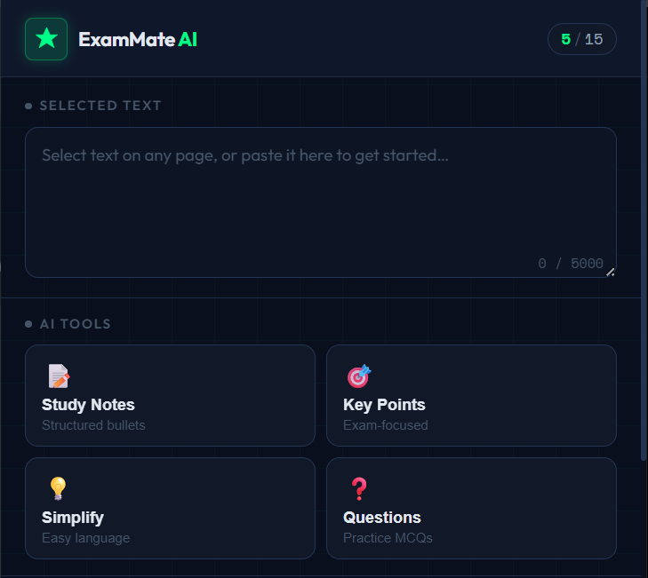

<div align="center">

# ExamMate AI

### AI-powered study assistant for your browser

**Turn any selected text into structured revision material — instantly, without leaving the page.**

[](https://developer.chrome.com/docs/extensions/mv3/)
[](https://ai.google.dev/)
[](https://vercel.com/)
[](LICENSE)
[]()

</div>

---

## Overview

ExamMate AI is a Chrome extension built to reduce the friction between reading and revising. Instead of copying text into a separate AI tab, highlighting, rephrasing, and reformatting the output yourself — ExamMate AI does it in place, in seconds, without breaking your reading flow.

Select any text on any webpage. Click a button. Get clean, structured, revision-ready output.

The project started as a personal frustration: using ChatGPT during study sessions meant constant context-switching — copy text, open tab, paste, wait, reformat, copy back. That workflow was breaking focus more than it was helping. ExamMate AI is the attempt to fix that with a purpose-built tool rather than a general-purpose chatbot.

This project is currently in MVP stage, focused on delivering a fast and reliable study workflow before expanding features further. The focus has been on getting the core workflow right — reliable AI output, fast revision formats, clean interface — before building anything else.

---
## 📸 Screenshots

### Main Interface


### Study Notes


### Simplify


### Key Points


### Questions


### Pomodoro Timer


## Features

**AI Study Tools**
- **Study Notes** — converts selected text into labelled, scannable bullet notes
- **Key Points** — extracts the 5 facts most likely to appear on an exam
- **Simplify** — rewrites complex content in plain language with a one-line takeaway
- **Practice Questions** — generates 2 MCQs, 2 short-answer, and 1 analytical question from the material

**Focus System**
- Pomodoro timer with 25-minute work and 5-minute break cycles
- Visual progress ring with smooth animation
- Daily session counter persisted in local storage

**Output Utilities**
- Copy to clipboard with visual confirmation
- Download output as a timestamped `.txt` file
- Character counter with colour-coded warnings on input

**Cost Controls** *(for API sustainability during MVP)*
- 15 AI requests per day per user
- 8-second cooldown between requests
- Input trimmed to 5,000 characters before sending
- All calls routed through Gemini 2.5 Flash — the most cost-efficient model in the Gemini family

---

## Why I Built This

The problem is not that AI tools for students don't exist. It's that none of them fit into a study workflow without interrupting it.

Opening a new tab, switching context, reformatting output, and switching back adds up. Over a 3-hour study session, those interruptions compound. The cognitive load of managing the tool starts competing with the cognitive load of learning the material.

A browser extension eliminates the tab-switching. Tight output templates eliminate the reformatting. A built-in timer keeps the session structure. These are small decisions individually, but together they change how the tool feels to use.

The secondary motivation was engineering: I wanted to work through the full cycle of building a real browser extension — from architecture decisions (Manifest V3, background service workers, message passing) through security considerations (API key handling, proxy architecture) to product iteration (what does good AI output actually look like for a student?). This project has touched all of those.

---

## Tech Stack

| Layer | Technology |
|---|---|
| Extension architecture | Chrome Extension Manifest V3 |
| AI model | Google Gemini 2.5 Flash |
| Backend proxy | Vercel Serverless Functions (Node.js) |
| API security | Vercel Environment Variables |
| Fonts | Outfit (UI) + Space Mono (code/timer) via Google Fonts |
| Icons | Custom SVG, rasterised to PNG at 4 sizes |
| Storage | `chrome.storage.local` (usage limits, session counts) |
| Downloads | Blob + `<a>` element in popup context (MV3 compatible) |

---

## Architecture

```
┌─────────────────────────────────────────────────────────┐
│                    Chrome Extension                       │
│                                                           │
│  ┌──────────────┐     messages      ┌─────────────────┐  │
│  │   popup.js   │ ──────────────▶   │  background.js  │  │
│  │  (UI layer)  │ ◀──────────────   │ (service worker)│  │
│  └──────────────┘                   └────────┬────────┘  │
│                                              │            │
│  ┌──────────────┐                            │ fetch()    │
│  │  content.js  │  (selected text capture)   │            │
│  └──────────────┘                            │            │
└─────────────────────────────────────────────┼────────────┘
                                               │
                                               ▼
                                   ┌───────────────────────┐
                                   │   Vercel Proxy         │
                                   │   /api/generate.js     │
                                   │   (serverless fn)      │
                                   └───────────┬───────────┘
                                               │
                                               ▼
                                   ┌───────────────────────┐
                                   │   Google Gemini API    │
                                   │   gemini-2.5-flash     │
                                   └───────────────────────┘
```

**Why a proxy?**
Chrome extensions are distributable packages — anyone who installs an extension can unpack it and read its source files. An API key in `background.js` is an API key in plain text. The Vercel proxy keeps the key in an environment variable on the server, out of reach of the extension's source code entirely.

**Why Manifest V3?**
MV3 is the current and future standard for Chrome extensions. It replaces persistent background pages with short-lived service workers, which has meaningful implications for how state and async operations are handled — covered in detail in the engineering challenges section.

---

## Folder Structure

```
exammate-ai/
│
├── manifest.json          # Extension config — permissions, icons, entry points
├── background.js          # Service worker — all AI API calls, prompt engineering
├── popup.html             # Extension popup — markup only, no inline scripts
├── popup.js               # UI logic — messaging, rendering, timer, download
├── content.js             # Content script — captures selected text from pages
├── style.css              # All visual styles — dark theme, layout, animations
│
├── icons/
│   ├── icon16.png
│   ├── icon32.png
│   ├── icon48.png
│   └── icon128.png
│
└── README.md
```

**Proxy (separate repository or Vercel project):**
```
exammate-proxy/
│
├── api/
│   └── generate.js        # Serverless function — receives prompt, calls Gemini
│
└── vercel.json            # Vercel config — function memory and timeout settings
```

---

## Installation

### Prerequisites
- Google Chrome (any recent version)
- A [Gemini API key](https://aistudio.google.com/app/apikey) (free tier is sufficient for development)
- A [Vercel account](https://vercel.com/) (free tier)
- A [GitHub account](https://github.com/) (for Vercel deployment)

---

### Step 1 — Deploy the Backend Proxy

The proxy must be deployed before the extension will work, because the extension calls the proxy rather than Gemini directly.

**Create the proxy project:**

```
exammate-proxy/
├── api/
│   └── generate.js
└── vercel.json
```

**`api/generate.js`:**
```javascript
export default async function handler(req, res) {
  res.setHeader('Access-Control-Allow-Origin', '*');
  res.setHeader('Access-Control-Allow-Methods', 'POST, OPTIONS');
  res.setHeader('Access-Control-Allow-Headers', 'Content-Type');

  if (req.method === 'OPTIONS') return res.status(200).end();
  if (req.method !== 'POST') return res.status(405).json({ error: 'Method not allowed' });

  const { prompt } = req.body;
  if (!prompt) return res.status(400).json({ error: 'No prompt provided' });

  const response = await fetch(
    `https://generativelanguage.googleapis.com/v1beta/models/gemini-2.5-flash:generateContent?key=${process.env.GEMINI_API_KEY}`,
    {
      method: 'POST',
      headers: { 'Content-Type': 'application/json' },
      body: JSON.stringify({
        contents: [{ parts: [{ text: prompt }] }],
        generationConfig: { temperature: 0.6, maxOutputTokens: 1024 }
      })
    }
  );

  const data = await response.json();
  res.status(200).json(data);
}
```

**`vercel.json`:**
```json
{
  "functions": {
    "api/generate.js": {
      "memory": 128,
      "maxDuration": 30
    }
  }
}
```

**Deploy:**
1. Push the proxy project to a GitHub repository
2. Go to [vercel.com](https://vercel.com) → New Project → Import the repo
3. Before deploying, add the environment variable (see below)
4. Deploy — Vercel gives you a URL like `https://your-project.vercel.app`

---

### Step 2 — Set the Environment Variable

In your Vercel project dashboard:
- Go to **Settings → Environment Variables**
- Add: `GEMINI_API_KEY` = your Gemini API key
- Redeploy for the variable to take effect

The API key never leaves Vercel's server environment. It is not in any file that ships with the extension.

---

### Step 3 — Configure the Extension

In `background.js`, set your proxy URL:
```javascript
const PROXY_URL = "https://your-project.vercel.app/api/generate";
```

In `manifest.json`, update `host_permissions` to match:
```json
"host_permissions": [
  "https://your-project.vercel.app/*"
]
```

---

### Step 4 — Load the Extension in Chrome

1. Open `chrome://extensions` in Chrome
2. Enable **Developer Mode** (toggle, top-right corner)
3. Click **Load unpacked**
4. Select the `exammate-ai` folder
5. The extension icon appears in your Chrome toolbar

---

### Step 5 — Test It

1. Go to any article, Wikipedia page, or study material
2. Select a paragraph of text
3. Click the ExamMate AI icon in the toolbar
4. The selected text loads automatically into the popup
5. Click any of the four AI buttons

---

## How It Works

### Text Selection
When the popup opens, `popup.js` uses `chrome.scripting.executeScript` to run a function in the active tab's context that reads `window.getSelection()`. This is more reliable than using `content.js` for this purpose because it executes at the moment the popup is opened, capturing the current selection state.

### Message Passing
`popup.js` sends a structured message to `background.js` using `chrome.runtime.sendMessage`. The background service worker handles the actual API call and returns the result. This separation is required because browser extensions restrict which contexts can make cross-origin network requests — the service worker is the correct place for all external calls.

### Prompt Engineering
Each of the four modes sends a different prompt to Gemini, but all prompts share a common constraint block that prevents the model from using markdown formatting, writing preambles, or producing verbose output. The prompts specify exact output templates that the model is instructed to fill — this is what produces consistent, structured output rather than free-form text.

### Output Rendering
`popup.js` parses the plain-text output from Gemini and applies styling programmatically — detecting section headers, numbered lists, MCQ options, and key-value pairs by pattern matching, then rendering each line type with appropriate visual treatment. This avoids requiring the AI to produce HTML and avoids the security issues that would come with rendering AI-generated HTML.

### Pomodoro Timer
The timer runs entirely in `popup.js`. Work and break durations, session count, and mode state are managed in JavaScript variables. Session counts are persisted to `chrome.storage.local` so they survive the popup being closed and reopened. The visual ring is an SVG circle with `stroke-dashoffset` animated via JavaScript on each tick.

---

## Engineering Challenges

### MV3 Service Worker Lifecycle
Manifest V3 replaces persistent background pages with service workers that Chrome can terminate after approximately 30 seconds of inactivity. When a terminated worker receives a message from `popup.js`, Chrome throws `"Could not establish connection. Receiving end does not exist."` — an error that in earlier versions of this code caused buttons to fail silently with no feedback to the user.

The fix is a `safeSendMessage` wrapper in `popup.js` that catches this specific error class, waits 600ms for the worker to reinitialise, and retries once. The act of sending the first message causes Chrome to restart the worker; the retry then succeeds. From the user's perspective, there is no visible failure.

### Empty AI Responses
Gemini returns HTTP 200 for several conditions that produce no usable text: safety filter blocks (`finishReason: "SAFETY"`), copyright filter triggers (`"RECITATION"`), response truncation (`"MAX_TOKENS"`), and occasional empty candidate arrays. The original code handled all of these identically with a generic "Empty response" error, which gave users no information about what had happened or what to do.

The fix inspects `finishReason` explicitly and returns a specific, actionable error message for each case. Unknown empty responses trigger one automatic retry after a 1.5-second delay, which handles transient Gemini inconsistencies without requiring user action.

### Vercel Cold Starts
Vercel's free tier spins down serverless functions after periods of inactivity. A cold start can take 8–15 seconds, which was causing the extension's fetch calls to time out. The fix adds an `AbortController` with a 25-second timeout, plus one automatic retry on timeout with a 2-second delay. This covers the cold start window without blocking the UI indefinitely.

### Download in MV3 Service Workers
An early version of this project used `chrome.downloads.download()` with a `blob:` URL created via `URL.createObjectURL()` in the service worker. This fails silently in MV3 — service workers do not have DOM access, and `Blob` and `URL.createObjectURL` are not available in that context.

The fix moves all download logic to `popup.js`, which runs in a standard browser page context with full DOM access. The popup creates the Blob, generates the object URL, appends an invisible `<a>` element to the document, triggers a click, and cleans up. This is the correct approach for file downloads in MV3 extensions.

### Message Channel Consistency
`chrome.runtime.onMessage` listeners in MV3 must return `true` synchronously if the response will be sent asynchronously — otherwise Chrome closes the message channel before the async operation completes and `sendResponse` silently fails. This is easy to get wrong when the async operation (an API call) happens inside a `.then()` chain rather than directly in the listener body. The listener in this project calls the async function, chains `.then(sendResponse)`, and returns `true` before the chain executes — maintaining the channel for the duration of the async operation.

---

## Product Design Philosophy

The core constraint in designing ExamMate AI's output was that a student using it during a revision session needs to be able to read the output in under 30 seconds, identify what matters, and move on. Long outputs fail this even if they are accurate.

**On output length:** Early versions used prompts that asked for "structured study notes" without enforcing length. The model produced thorough, well-organised — and completely impractical — outputs. A student revising for an exam does not need a 400-word explanation of photosynthesis in their study notes. They need "Inputs: CO₂ + H₂O + sunlight → Glucose + O₂" and nothing else. Enforcing this required negative instructions (explicit rules about what NOT to do) in addition to template instructions.

**On formatting:** Markdown symbols in AI output look correct in a markdown renderer but are noise in a plain-text display. The prompts explicitly prohibit `**`, `##`, and similar symbols. The renderer in `popup.js` instead detects output structure by pattern — section headers, numbered items, key-value pairs — and applies visual styling programmatically. This produces cleaner output than relying on the model to format for a display it cannot see.

**On cognitive load:** Every feature decision was evaluated against one question: does this require the student to think about the tool, or does it let them think about the material? The text auto-loads from the page selection. The output format is predictable and consistent. The timer runs without configuration. Features that would require setup, preference management, or decisions were removed or deferred.

---

## Cost Control

API costs are the primary operating risk for any student-built tool using a commercial AI API. ExamMate AI addresses this with four independent controls:

| Control | Implementation | Effect |
|---|---|---|
| Daily request limit | 15 requests/day stored in `chrome.storage.local`, checked before each call | Hard ceiling on per-user API spend |
| Request cooldown | 8-second minimum interval between requests, tracked in service worker memory | Prevents rapid repeated calls |
| Input trimming | Text truncated to 5,000 characters before sending | Limits token count per prompt |
| Model selection | Gemini 2.5 Flash only — lower cost per token than Gemini Pro or Ultra | Baseline cost efficiency |

The daily limit is currently enforced client-side, which means it is bypassable by a technically capable user who clears extension storage. For a production deployment, this limit should be moved server-side on the Vercel proxy, keyed to a session ID generated on first install. This is a known limitation of the current MVP architecture.

---

## Security

**What is protected:** The Gemini API key. In any distributable Chrome extension, files in the extension package are readable by anyone who installs it. The original version of this project placed the API key directly in `background.js` — correct for local development, a real problem for distribution.

**How it is protected:** The Vercel proxy holds the key as an environment variable. The extension sends prompts to the proxy URL; the proxy adds the key and forwards to Gemini. The key is never in the extension package.

**What is not protected:** The proxy endpoint itself is public and accepts POST requests from any origin. For an MVP with low traffic this is acceptable, but a production deployment should add origin validation, per-user rate limiting server-side, and ideally some form of session authentication to prevent third-party use of the proxy.

**Data handling:** Selected text is sent to the proxy and forwarded to Gemini. Neither the proxy nor any server-side storage retains this text after the response is returned. Gemini's own data handling applies — users should be aware that submitted text is processed by Google's API under Google's terms.

---

## Roadmap

These are features that make sense after the core experience is validated with real users — not features being built speculatively.

**Near-term (post-launch, v1.1)**
- [ ] First-run onboarding screen explaining how to use the extension
- [ ] Visual indicator on action buttons showing which was last used
- [ ] Server-side rate limiting on the Vercel proxy (replacing client-side enforcement)

**Medium-term (v1.x)**
- [ ] Note history — persisted locally, searchable by date
- [ ] Subject tagging on saved notes
- [ ] Customisable Pomodoro durations
- [ ] Export to Markdown in addition to plain text

**Longer-term (requires backend + accounts)**
- [ ] Cloud sync for notes across devices
- [ ] Flashcard mode (front/back format, optimised for spaced repetition)
- [ ] PDF support via OCR or browser PDF viewer integration
- [ ] Web dashboard for reviewing saved notes outside the browser

---

## Lessons Learned

**On MV3:** Service worker lifecycle management is the most consequential architectural difference from MV2. The failure modes — silent message drops, lost state, unavailable APIs — are not well-documented in the official Chrome extension docs. Testing needs to include explicitly terminating the service worker (via `chrome://serviceworker-internals`) and verifying that all user-facing flows recover gracefully.

**On AI outputs:** Prompt engineering for structured output is iterative. The first version of every prompt in this project produced outputs that were technically correct but practically unusable — too long, too variable in format, too similar to each other in content. Getting consistent, compact, genuinely distinct outputs from the four modes required several rounds of adding negative constraints and explicit templates. The single most effective change was switching from "write study notes" to "fill in this exact template and nothing else."

**On debugging Chrome extensions:** Chrome DevTools for extensions is good but has gaps. The service worker console (accessible via `chrome://extensions → inspect views`) loses logs when the worker is terminated. For debugging async message flows, explicit error returns at every possible failure point are more useful than console logs because they surface in the UI rather than disappearing with the worker.

**On building and shipping:** A working extension with limited features shipped to 10 real users teaches more than a polished extension with full features that exists only locally. The instinct to keep building before sharing is strong and usually wrong.

---

## Contributing

This is a personal project in active development. If you find a bug, have a specific suggestion, or want to contribute something concrete, open an issue describing what you have in mind before writing code.

Pull requests that fix documented bugs, improve prompt engineering, or address the security limitations described above are welcome.


---

## License

MIT License — see [LICENSE](LICENSE) for details.

You are free to use, fork, and modify this project. If you build something from it, attribution is appreciated but not required.

---

## Acknowledgements

- [Google Gemini API](https://ai.google.dev/) — for the AI capabilities
- [Vercel](https://vercel.com/) — for making serverless deployment straightforward
- [Chrome Extensions documentation](https://developer.chrome.com/docs/extensions/) — and the developer community for filling the gaps that documentation leaves

---

<div align="center">

Designed to make studying faster, cleaner, and less distracting.

*Questions or feedback → open an issue.*

</div>
